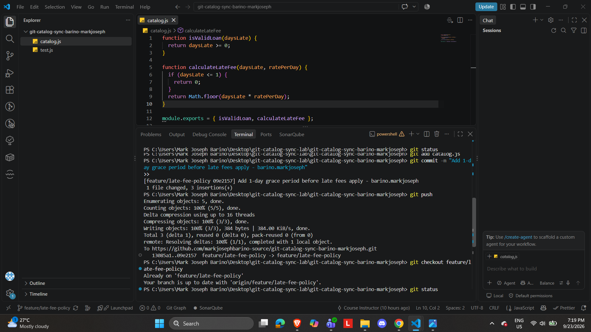

# WORKFLOW.md — Catalog Sync Lab

**Author:** Barino, Mark Joseph

## Task Screenshots

### Task 1 — Push a change from Clone A


### Task 2 — Diverge from Clone B and get rejected


### Task 3 — Reconcile with a merge


### Task 4 — Bring in the third contributor and get rejected again


### Task 5 — Reconcile a three-way merge


### Task 6 — Diverge a third time, reconcile with a rebase


### Task 7 — Merge into main, tag


## Written Answers

### 1. Walk through the final `calculateLateFee` function and name which contributor's change is responsible for each part.

The final function looks like this:

```js
function calculateLateFee(daysLate, ratePerDay) {
  if (daysLate <= 1) {
    return 0;
  }
  let fee = Math.round(daysLate * ratePerDay);
  fee = Math.max(fee, 1);
  fee = Math.min(fee, 20);
  return fee;
}
```

- `if (daysLate <= 1) { return 0; }` — this is my grace period change from Task 1 (Clone A). If someone is 1 day late or less, no fee is charged at all.
- `Math.round(daysLate * ratePerDay)` — this is Clone B's change from Task 2/3. The original code used `Math.floor` to truncate the fee; Clone B changed it to round to the nearest whole number instead.
- `fee = Math.max(fee, 1)` — this is my $1 minimum fee change from Task 6 (Clone A), added later through the rebase. It guarantees the fee is never less than $1 once it's actually being charged.
- `fee = Math.min(fee, 20)` — this is Clone C's $20 maximum cap from Task 4/5. It guarantees the fee never exceeds $20, no matter how many days late.

### 2. Compare Task 3's two-way conflict to Task 5's three-way conflict — what got harder with a third line of work?

In Task 3, I only had to compare two versions of the function — my grace period change and Clone B's rounding change. It was easy to see both blocks and combine them into one function.

In Task 5, there were three different versions of the logic touching the same lines: the grace period, the rounding, and the $20 cap. It was harder to be sure I hadn't accidentally left out one of the changes, since Git only shows you two sides of a conflict at a time (current vs incoming) — even though three total contributions were involved. I had to slow down and manually re-check that all three behaviors were present in the final code, and run the tests to be sure nothing broke.

### 3. What's the actual difference between how you resolved Task 5 (merge) and Task 6 (rebase)?

In Task 5, I used `git merge`, which combines the two diverged histories and creates a new merge commit that has two parent commits. The original commit history of both branches stays intact — you can still see each contributor's separate commits in the log.

In Task 6, I used `git rebase`, which instead replayed my $1 minimum fee commit on top of the already-updated branch, as if I had made that change after everyone else's work was already there. This rewrites history to look like a straight, linear sequence of commits instead of showing a merge point. The conflict-resolving felt similar (I still had to manually combine the code), but the resulting git history looks different — merge preserves the branching structure, while rebase makes it look like one continuous line of commits.

### 4. If this were a real team of three, what one process change would have prevented all three rejected pushes?

If we had communicated before starting — for example, agreeing to `git pull` or `git fetch` immediately before making any change, and pushing small changes frequently instead of working in isolation — we would have caught each other's changes early instead of finding out only when a push got rejected. Even just running `git fetch` at the start of each work session would have shown that teammates had already pushed changes, so we could pull those in before starting our own edits.